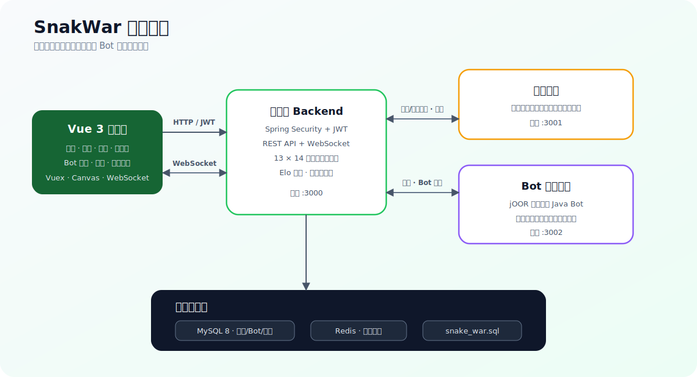

<div align="center">

# SnakWar · 蛇影行踪

基于 **Vue 3 + Spring Boot + WebSocket** 的在线贪吃蛇策略对战平台

[](https://openjdk.org/)
[](https://spring.io/projects/spring-boot)
[](https://vuejs.org/)
[](https://www.mysql.com/)
[](https://redis.io/)
[](https://developer.mozilla.org/docs/Web/API/WebSockets_API)

SnakWar 将经典贪吃蛇改造成双人回合制策略对战：玩家可以亲自操作，也可以编写 Java Bot 自动决策。  
平台提供账号认证、实时匹配、在线对战、Bot 管理、Elo 积分、排行榜、战绩查询和对局回放。

</div>

> [!WARNING]
> Bot 运行服务会动态编译并执行用户提交的 Java 代码。当前实现适合本地学习和可信环境演示，不应直接暴露到公网。生产化前必须将 Bot 执行迁移到严格隔离的容器/沙箱，并限制 CPU、内存、网络、文件系统和执行时间。

## 目录

- [功能特性](#功能特性)
- [系统架构](#系统架构)
- [游戏机制](#游戏机制)
- [技术栈](#技术栈)
- [项目结构](#项目结构)
- [环境要求](#环境要求)
- [快速开始](#快速开始)
- [服务与端口](#服务与端口)
- [Bot 开发](#bot-开发)
- [配置与部署](#配置与部署)
- [常见问题](#常见问题)
- [安全建议](#安全建议)
- [参与贡献](#参与贡献)
- [许可证](#许可证)

## 功能特性

### 账号与认证

- 用户注册、登录和 JWT 身份认证
- Spring Security 请求过滤与接口授权
- 本地登录状态持久化
- 预留 AcWing OAuth 网页端/App 端登录流程

### 在线对战

- WebSocket 实时双向通信
- 玩家手动操作、玩家对 Bot、Bot 对 Bot
- 13 × 14 中心对称随机地图
- 服务端统一接收操作并判定碰撞、胜负和超时
- Canvas 动画渲染与结果面板

### 匹配与积分

- 独立匹配服务维护等待池
- 根据双方 Elo 积分差进行匹配
- 等待时间越长，允许匹配的积分范围越大
- 对局结束后按 Elo 公式更新积分
- 分页排行榜

### Bot 与回放

- Bot 新增、修改、删除和列表管理
- 基于 Ace Editor 的在线代码编辑
- jOOR 动态编译 Java Bot
- Bot 线程池异步执行
- 对战地图、双方初始位置、移动序列和结果持久化
- 历史对局列表与逐步回放

## 系统架构



系统由四个可独立启动的部分组成：

1. Vue 客户端通过 REST API 完成登录、Bot 管理、排行榜和战绩查询。
2. 客户端通过 WebSocket 与主服务交换匹配和每回合移动事件。
3. 主服务把待匹配玩家交给匹配服务，并在匹配完成后创建游戏线程。
4. 当玩家选择 Bot 时，主服务把当前局面和 Bot 代码交给 Bot 运行服务，等待其返回下一步方向。

## 游戏机制

### 地图

- 每局生成 `13 × 14` 的网格地图。
- 边界全部为墙，内部随机生成 20 个中心对称障碍。
- 使用 Flood Fill 检查两个出生点是否连通；不连通时重新生成。
- 玩家 A 从左下角附近出生，玩家 B 从右上角附近出生。

### 操作

手动玩家使用键盘控制：

| 按键 | 方向 | Bot 返回值 |
| --- | --- | ---: |
| `W` | 上 | `0` |
| `D` | 右 | `1` |
| `S` | 下 | `2` |
| `A` | 左 | `3` |

### 胜负与积分

- 撞墙、撞到自己或对手身体时判负。
- 双方同回合均发生碰撞或均未按时返回方向时判平。
- 每回合有最长等待时间，超时的一方判负。
- 对局结束后使用 `K = 32` 的 Elo 公式调整双方积分，积分最低为 0。

## 技术栈

| 层级 | 技术 |
| --- | --- |
| 前端 | Vue 3.2、Vue Router 4、Vuex 4、Vue CLI 5 |
| UI 与编辑器 | Bootstrap 5、jQuery、vue3-ace-editor |
| 游戏渲染 | HTML5 Canvas、自定义动画对象系统 |
| 后端 | Java 17、Spring Boot 2.7.3 |
| 安全 | Spring Security、JWT |
| 实时通信 | WebSocket |
| 数据访问 | MySQL 8、MyBatis-Plus 3.5.2 |
| 缓存 | Redis |
| Bot 执行 | jOOR 0.9.14、线程池 |
| 构建 | Maven Wrapper 3.8.7、npm |

> 后端父 POM 中仍保留 `java.version=1.8`，但三个业务模块的编译目标均为 Java 17，因此请使用 JDK 17 构建和运行。

## 项目结构

```text
SnakWar/
├── backendcloud/
│   ├── backend/                    # 主服务：认证、WebSocket、游戏与业务 API
│   ├── mathcingsystem/             # 匹配服务（目录名沿用现有拼写）
│   ├── botrunningsystem/           # Bot 动态编译与执行服务
│   ├── mvnw / mvnw.cmd             # Maven Wrapper
│   └── pom.xml                     # 后端聚合工程
├── web/
│   ├── public/
│   ├── src/
│   │   ├── assets/scripts/         # 游戏对象、地图、蛇和墙体逻辑
│   │   ├── components/             # 地图、匹配、结果等组件
│   │   ├── router/                 # 前端路由与登录守卫
│   │   ├── store/                  # 用户、对战和战绩状态
│   │   └── views/                  # 对战、排行榜、记录、Bot、账号页面
│   └── package.json
├── docs/
│   └── images/                     # README 图片
├── snake_war.sql                   # MySQL 表结构与演示数据
└── readme.md
```

## 环境要求

| 软件 | 建议版本 |
| --- | --- |
| JDK | 17 |
| Node.js | 16+，推荐使用当前 LTS |
| npm | 与 Node.js 配套版本 |
| MySQL | 8.x |
| Redis | 6.x / 7.x |
| Maven | 可直接使用仓库中的 Maven Wrapper |

## 快速开始

### 1. 获取代码

```bash
git clone https://github.com/Dong030928/SnakWar.git
cd SnakWar
```

### 2. 初始化数据库

先创建 `kob` 数据库：

```sql
CREATE DATABASE kob
  DEFAULT CHARACTER SET utf8mb4
  COLLATE utf8mb4_unicode_ci;
```

导入仓库中的 SQL：

```bash
mysql -u root -p kob < snake_war.sql
```

> [!IMPORTANT]
> `snake_war.sql` 除表结构外还包含历史演示账号、Bot 和对局数据。公开部署前建议仅保留 `bot`、`record`、`user` 三张表的建表语句，清理不需要的样例内容并创建自己的管理员/测试账号。

### 3. 启动 Redis

默认配置：

```text
host: 127.0.0.1
port: 6379
```

如 Redis 设置了密码，请同步修改：

```text
backendcloud/backend/src/main/resources/application.properties
```

### 4. 配置主服务

修改 `backendcloud/backend/src/main/resources/application.properties`：

```properties
server.port=3000

spring.datasource.username=你的数据库用户
spring.datasource.password=你的数据库密码
spring.datasource.url=jdbc:mysql://localhost:3306/kob?serverTimezone=Asia/Shanghai&useUnicode=true&characterEncoding=utf-8

spring.redis.host=127.0.0.1
spring.redis.port=6379
spring.redis.password=你的Redis密码
```

不要在公开仓库中提交真实密码。

### 5. 构建后端

Windows：

```powershell
cd backendcloud
.\mvnw.cmd clean package -DskipTests
```

macOS / Linux：

```bash
cd backendcloud
chmod +x mvnw
./mvnw clean package -DskipTests
```

### 6. 启动三个后端进程

在三个终端中分别执行：

```bash
# 主服务，端口 3000
./mvnw -pl backend spring-boot:run

# 匹配服务，端口 3001
./mvnw -pl mathcingsystem spring-boot:run

# Bot 运行服务，端口 3002
./mvnw -pl botrunningsystem spring-boot:run
```

Windows 将 `./mvnw` 替换为 `.\mvnw.cmd`。

建议先启动 MySQL 和 Redis，然后启动 `backend`、`mathcingsystem`、`botrunningsystem`。

### 7. 启动前端

```bash
cd web
npm ci
npm run serve
```

默认访问地址通常为：

```text
http://localhost:8080
```

前端源码当前使用：

```text
HTTP:      http://127.0.0.1:3000
WebSocket: ws://127.0.0.1:3000/websocket/{token}
```

注册并登录两个账号后，可在两个浏览器窗口分别加入匹配，或为任意一方选择 Bot。

## 服务与端口

| 服务 | 目录 | 默认端口 | 作用 |
| --- | --- | ---: | --- |
| Web 前端 | `web` | `8080` | 页面、Canvas 游戏与状态管理 |
| Backend | `backendcloud/backend` | `3000` | REST、JWT、WebSocket、游戏与持久化 |
| Matching System | `backendcloud/mathcingsystem` | `3001` | 玩家等待池与动态积分匹配 |
| Bot Running System | `backendcloud/botrunningsystem` | `3002` | Bot 编译、执行与方向回传 |
| MySQL | — | `3306` | 用户、Bot 和对战记录 |
| Redis | — | `6379` | 缓存/状态支持 |

模块间存在以下本地调用：

```text
backend -> http://127.0.0.1:3001/player/add|remove
matching -> http://127.0.0.1:3000/pk/start/game
backend -> http://127.0.0.1:3002/bot/add
bot runner -> http://127.0.0.1:3000/pk/receive/bot/move
```

## Bot 开发

Bot 必须提供 `nextMove(String input)` 方法，并返回 `0`、`1`、`2`、`3` 中的一个方向。

最小示例：

```java
package com.snake_war.botrunningsystem.utils;

public class Bot implements BotInterface {
    @Override
    public Integer nextMove(String input) {
        // 0: 上，1: 右，2: 下，3: 左
        return 0;
    }
}
```

传入的局面格式为：

```text
map#mySx#mySy#(mySteps)#opponentSx#opponentSy#(opponentSteps)
```

- `map`：按行展开的 `13 × 14` 地图字符串，`0` 表示空地，`1` 表示墙。
- `Sx`、`Sy`：双方出生位置。
- `Steps`：从开局到当前回合的方向序列。

Bot 应在单回合时限内完成计算。实际开发时请处理非法输入，并确保始终返回合法方向。

## 配置与部署

### 前端 API 地址

开发地址目前分散在 `web/src/store/user.js`、对战、排行榜、战绩和 Bot 页面中。部署前建议统一抽取为环境变量，例如：

```env
VUE_APP_API_BASE_URL=https://example.com
VUE_APP_WS_BASE_URL=wss://example.com
```

### 后端模块地址

三个后端服务之间的 URL 当前以 `127.0.0.1` 硬编码。容器化或分布式部署时，需要改为可解析的服务名或配置项。

### HTTPS 与 WebSocket

页面通过 HTTPS 发布时，WebSocket 必须使用 `wss://`，否则浏览器会阻止混合内容。

### OAuth

AcWing OAuth 回调地址和相关参数需替换为自己的应用配置。若不使用第三方登录，可保持对应入口关闭。

## 常见问题

### 后端无法连接 MySQL

- 确认已创建 `kob` 数据库并导入 `snake_war.sql`。
- 检查用户名、密码、端口及 MySQL 8 时区参数。
- 确认数据库字符集支持 `utf8mb4`。

### 登录后无法进入匹配

- 确认三个 Spring Boot 进程均已启动。
- 检查浏览器控制台中的 WebSocket 连接。
- 确认 `3000`、`3001`、`3002` 端口未被占用。

### 前端请求出现跨域或连接错误

- 确认 HTTP 请求指向 `http://127.0.0.1:3000`。
- 检查主服务的 CORS 配置。
- 真机或其他电脑访问时不能使用 `127.0.0.1`，应改为服务端局域网 IP。

### Bot 一直超时

- 确认 Bot 运行服务 `3002` 正常。
- 检查 Bot 是否声明了正确的包名、类名和接口。
- 确认 `nextMove` 返回 `0` 到 `3` 的整数，且没有死循环或阻塞操作。

### Maven 编译版本错误

确认 `java -version` 和 `mvn -version` 均指向 JDK 17。项目依赖中混用了部分 Spring Boot 2.7 与 3.x 组件，若出现兼容性问题，建议统一依赖版本后再部署。

## 安全建议

在公网部署前至少完成以下工作：

- 轮换并移除仓库中的数据库、Redis 和第三方 OAuth 示例凭据。
- 使用环境变量或专用密钥管理服务保存密码与密钥。
- 将 Bot 放入无特权容器/沙箱，禁止访问宿主机文件、内网和外部网络。
- 对 Bot 设置 CPU、内存、线程数、代码长度和执行时间限制。
- 为注册、登录、匹配和 Bot 提交接口增加限流与审计。
- 校验 WebSocket Token，并限制消息大小和发送频率。
- 清理 SQL 演示数据、日志中的 Token 和用户隐私信息。
- 补充单元测试、集成测试、健康检查、监控与备份策略。

## 参与贡献

欢迎通过 Issue 和 Pull Request 改进 SnakWar。

1. Fork 仓库并创建功能分支。
2. 保持改动聚焦，补充必要的测试和说明。
3. 提交前运行 `npm run lint` 和后端测试。
4. 确认提交中不包含密码、Token、私钥或用户数据。
5. 发起 Pull Request 并描述修改内容和验证方式。

## 许可证

当前仓库未提供 `LICENSE` 文件。在作者明确许可证之前，默认保留全部权利；如计划开放分发或协作，请先添加合适的开源许可证。

---

<div align="center">

如果这个项目对你有帮助，欢迎点一个 ⭐ Star。

</div>

